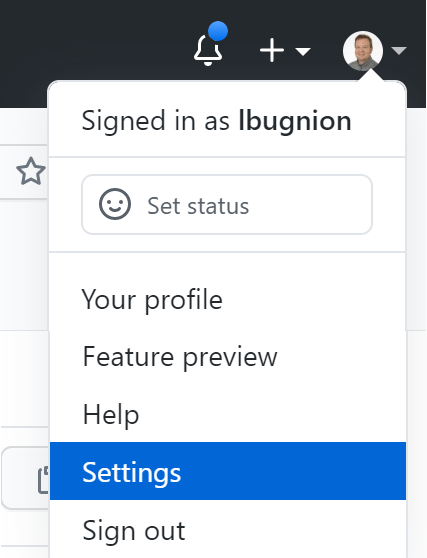
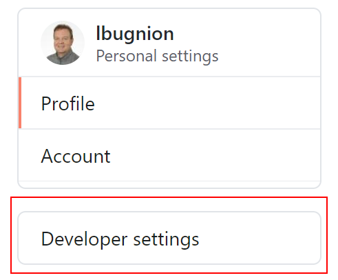
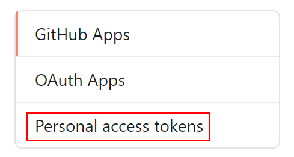
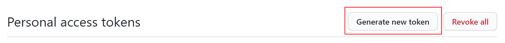
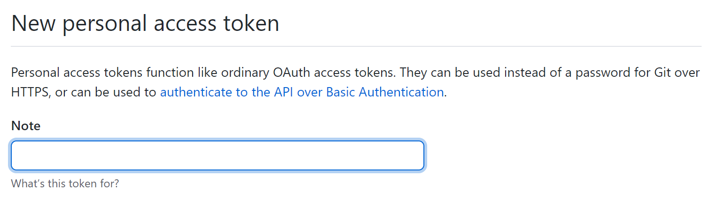
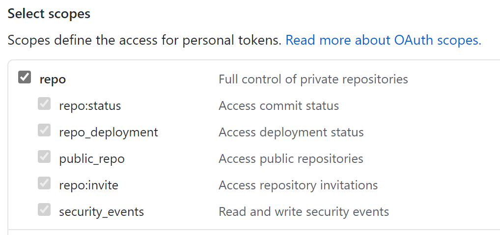
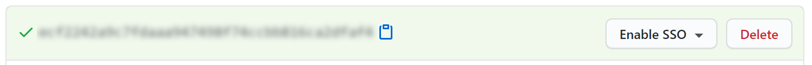
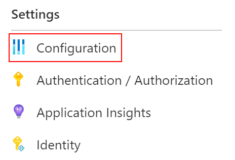
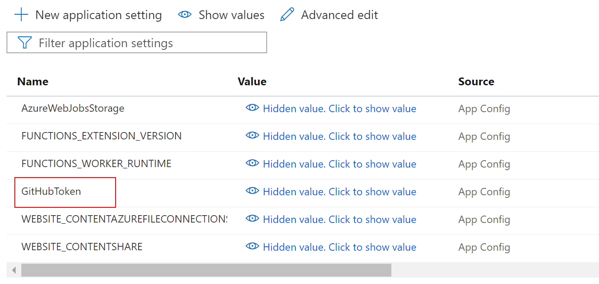
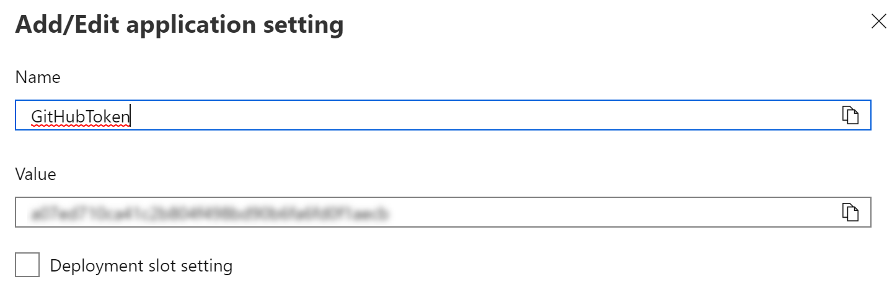

# Autocommit Azure Function

Welcome to the Autocommit serverless function for Microsoft Azure.

## If you know already

You can deploy the Function to Azure using this ARM template. Simply [click on the `Deploy to Azure` button below](#deploy) and follow the instructions.

## And if you don't know

<a id="deploy"></a>

### Deploying to Azure

Click on the button below to open the Azure Resource Manager template dialog.

> You can also right-click and select `Open link in new tab` if you want to keep this page open.

[](https://portal.azure.com/?WT.mc_id=dotnet-0000-lbugnion#create/Microsoft.Template/uri/https%3A%2F%2Fraw.githubusercontent.com%2Flbugnion%2Fazure-function-auto-commit%2Fmaster%2FDeploy%2Fautocommit-template.json)

You should see the following dialog:


- `Subscription`: Select the subscription to which you want to deploy the Azure Function.
- `Resource group`: Select the resource group you want to use, or create a new resource group.
- `Region`: Any Azure region should work. Typically you want to choose a region closer to your users.
- `Function App Name`: Enter a **unique name** for the Azure Function.
- `Github Token`: Enter a GitHub security token in order for the Autocommit function to be able to impersonate you. [See the instructions below to create such a token](#token).

> **Important** The name for the Azure Function must be unique worldwide because it will be part of the HTTP API URL.

### Using the Function

In order to commit files to a repo using the Function, you need to send a POST request to the HTTP endpoint that hosts the Function.

You can do this from any HTTP client, for example in .NET, Azure Logic App, GitHub actions and many many more.

Here is a sample request:

```http
POST https://[FUNCTION NAME].azurewebsites.net/api/autocommit
Content-Type: application/json
x-functions-key: [FUNCTION KEY]

{
    "account": "[GITHUB ACCOUNT NAME]",
    "repo": "[GITHUB REPO]",
    "branch": "[BRANCH TO COMMIT]",
    "message": "[COMMIT MESSAGE]",
    "files": [
        {
            "path": "[PATH OF FILE 1]",
            "content": "[CONTENT OF FILE 1]"
        },
        {
            "path": "[PATH OF FILE 2]",
            "content": "[CONTENT OF FILE 2]"
        }
    ]
}

```

#### Explanation

> **Consider the following:**

> **Branches**: If a branch does not exist in the repo, an error will be returned to the user and nothing will be committed. Always ensure that the branch already exists before you call the Function.

> **Folders**: If a folder (in the path) is non existing, it will be automatically created.

> **Files**: If a file doesn't exist yet, it will be created. If the file already exist, then a new version of the file will be created and committed to the repo.

|Placeholder|Description|Example/Note|
|-----------|-----------|-------|
|`[FUNCTION NAME]`|The name of the Function application which you created earlier.||
|`[FUNCTION KEY]`|The function key authorizing access to your Azure Function|[See below](#function-key)|
|`[GITHUB ACCOUNT NAME]`|The name of the GitHub account to which you want to commit|`lbugnion`|
|`[GITHUB REPO]`|The repository to which you want to commit the files|`my-test-repo`|
|`[BRANCH TO COMMIT]`|The branch to which you want to commit|[IMPORTANT NOTE ABOUT BRANCHES](#branches)|
|`[COMMIT MESSAGE]`|The message that will be appended to this commit|`This is a commit message`|
|`files`|You can commit multiple files at once with the same message. Pass the files as a JSON array of objects||
|`[PATH OF FILE]`|The path of the file, relative to the repo's root.**If a folder doesn't exist yet, it will be automatically created**|`myfolder/myfile.md`
|`[CONTENT OF FILE]`|The content of the file that you want to create or modify. At the moment we only support text files|

<a id="token"></a>

## Creating the GitHub token

These instructions will help you to create a GitHub security token if you have never done it before.

1. Go to [GitHub](http://github.com) and log into your account.

2. Click on your picture in the top-right and expand the menu. Select `Settings`.



3. In the Settings, click on `Developer settings`.



4. Click on `Personal access tokens`.



5. Click on `Generate a new token`.



6. Enter a note identifying the token. This is so you can remember what the token is for, in case you need to delete it later.



7. Select the `repo` scope. All other scopes are not needed.



8. Click on `Generate token`.


9. After the token was generated, copy the token's value and make sure to save it somewhere safe. You can never see the value again, so if you lose it and need it again, you will need to generate a new token.



## Replacing a token

Normally you need the token only once, when you deploy the function, in the custom ARM template described above. But sometimes you may want to use a new token, for example if the old one was compromised. You can create a new token [following the steps above](#token), then copy the value of the token and follow the steps.

1. Once you have the token, open the [Azure Portal](https://portal.azure.com/?WT.mc_id=dotnet-0000-lbugnion) and locate your Azure Function. You can use the filter to search for the function's name, or look into the `App Services` category.

2. Click on `Configuration`.



3. Click on the setting called `GitHubToken`.



4. Replace the old token's value with the new value you created above.



5. Click on `OK` to close the edit drawer, then click on the `Save` button. The new configuration will take a few seconds to be applied.